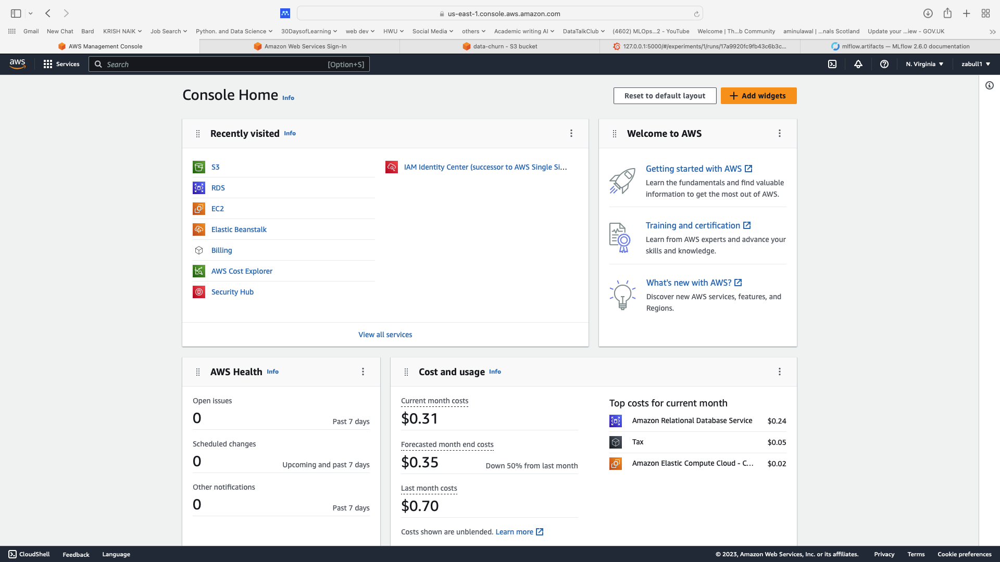
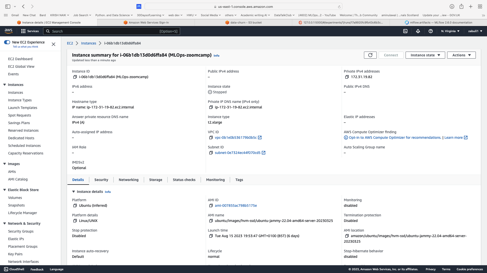
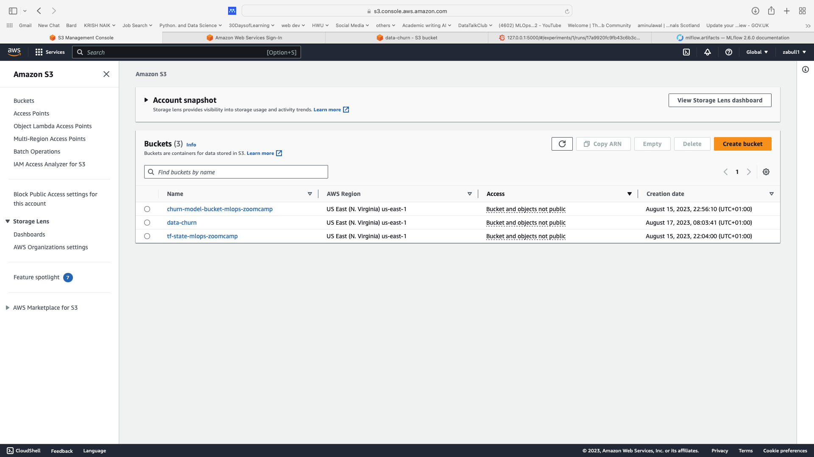
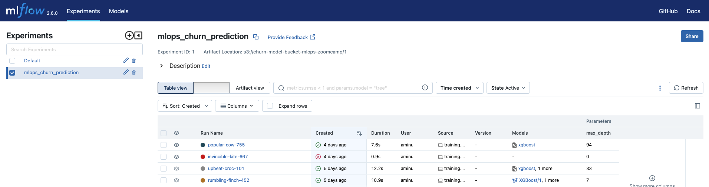
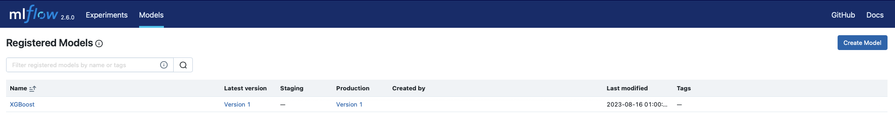
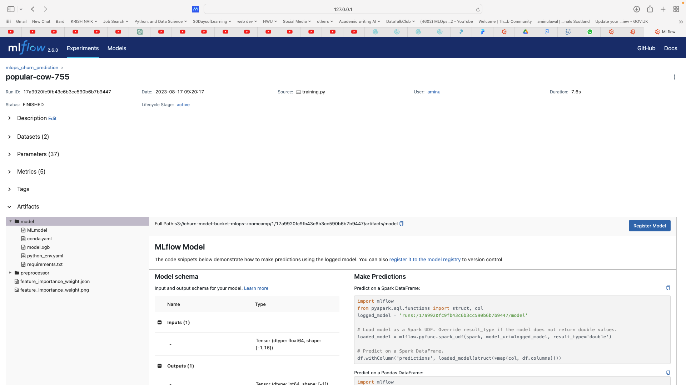
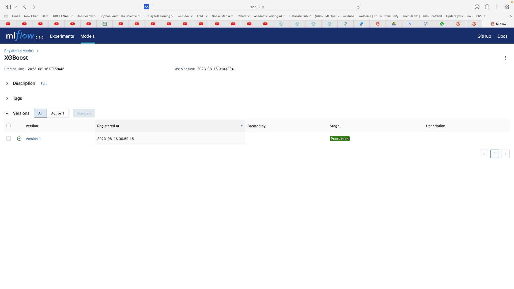
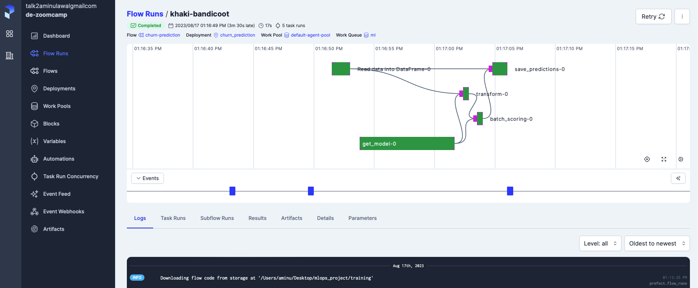
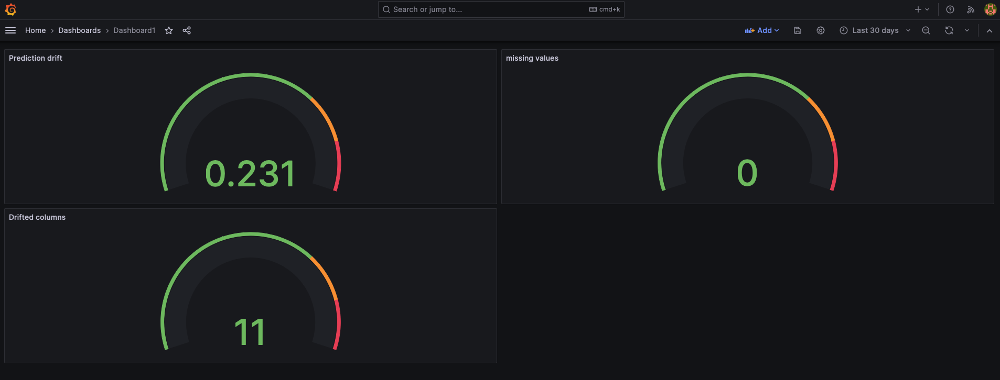
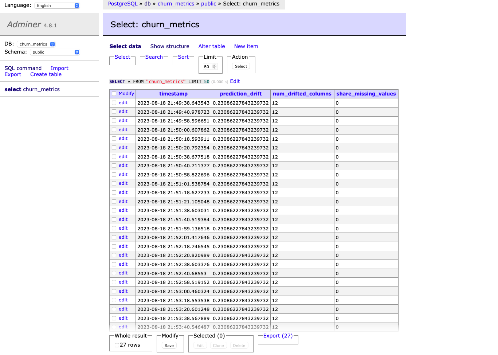

# MLOps Churn Project


# 1. Problem description

A leading telecom company, **Zabull Telecoms**, has been experiencing a high churn rate among its customers. The churn rate refers to the percentage of customers who cancel their subscription services within a given period. This high churn rate is causing a significant loss in revenue and customer base, and the company is keen on reducing it to remain competitive in the market.

The telecom company collects customer data, including call records, customer demographics, and service usage history. The management believes that by implementing a machine learning solution to predict customer churn in advance, they can take proactive measures to retain at-risk customers and reduce churn.

We aim to develop an end-to-end MLOps (Machine Learning Operations) solution for churn prediction.

* Problem type: Supervised/Classification

## Dataset

The data can be found on [kaggle](https://www.kaggle.com/datasets/mnassrib/telecom-churn-datasets)

- **State**: the US state in which the customer resides, indicated by a two-letter abbreviation; for example, OH or NJ
- **Account Length**: the number of days that this account has been active
- **Area Code**: the three-digit area code of the corresponding customer’s phone number
- **Int’l Plan**: whether the customer has an international calling plan: yes/no
- **VMail Plan**: whether the customer has a voice mail feature: yes/no
- **VMail Message**: the average number of voice mail messages per month
- **Day Mins**: the total number of calling minutes used during the day
- **Day Calls**: the total number of calls placed during the day
- **Day Charge**: the billed cost of daytime calls
- **Eve Mins**, **Eve Calls**, **Eve Charge**: the billed cost for calls placed during the evening
- **Night Mins**, **Night Calls**, **Night Charge**: the billed cost for calls placed during nighttime
- **Intl Mins**, **Intl Calls**, **Intl Charge**: the billed cost for international calls
- **CustServ Calls**: the number of calls placed to Customer Service
- **Churn?**: whether the customer left the service: true/false

## Proposed Approach

To address the Zabull Telecoms churn problem above, we aim to develop a predictive model that reliably detects customers inclined to churn. This model will provide the company with valuable insights, enabling them to adopt proactive measures such as tailored incentives, personalized services, or early intervention tactics. Since the model is for churn prediction, we are deploying the model in batches.

# 2. Technologies Used

Below are the technologies used in this project

## Cloud

- **AWS (Amazon Web Services):** AWS is used for cloud-based infrastructure. The project was developed entirely on AWS cloud as required


We made use of  **Amazon EC2**  instances for virtual machines (VMs)



**Amazon S3: Amazon Simple Storage Service (S3)**  was employed for secure and scalable data storage. Mainly used to store all our artifacts and models from the experiments we conducted during model training



We used  **Terraform** for for Infrastructure as Code (IAC) to define, provision, and manage cloud resources as also required.

## Experiment Tracking

For experiment tracking and model registry we used **mlflow** as seen below










## Workflow Orchestration

We used prefect for all orchestration in model training, model batch deployment or scoring and model monitoring



## Deployment

We deploy our model using the batch method of deployment since our use case is churning. We also used **Docker** to deploy our model 

## Model Monitoring

We used grafana and prostgres to monitor the performance of our model over time. We also implement alert when the prediction drift threshold is violated





# 3. Best Practices

below best practices were used

- 1. tests: both unit and integrated tests were carried out
- 2. Infratructure as code (IAC) terraform was used to define, provision, and manage cloud resources
- 3. Makefile was used
- 4. Pylint and black were also used linting and formatting
- 5. Pre-commit was aslso used


# 3. Reproducibility

- To setup the environment see 
- clone the repo ```git clone https://github.com/zabull1/mlops_churn_project.git```
- update the .env.py file with .env with your credentials
- run  ```mlflow ui \    
            --backend-store-uri sqlite:///mlflow.db \
            --default-artifact-root s3://churn-model-bucket-mlops-zoomcamp```
- change the directory to ```training/``` and run ```training.py```
- run the deployment ```batch_scoring_deploy.py```
- run ```docker-compose up -build```

